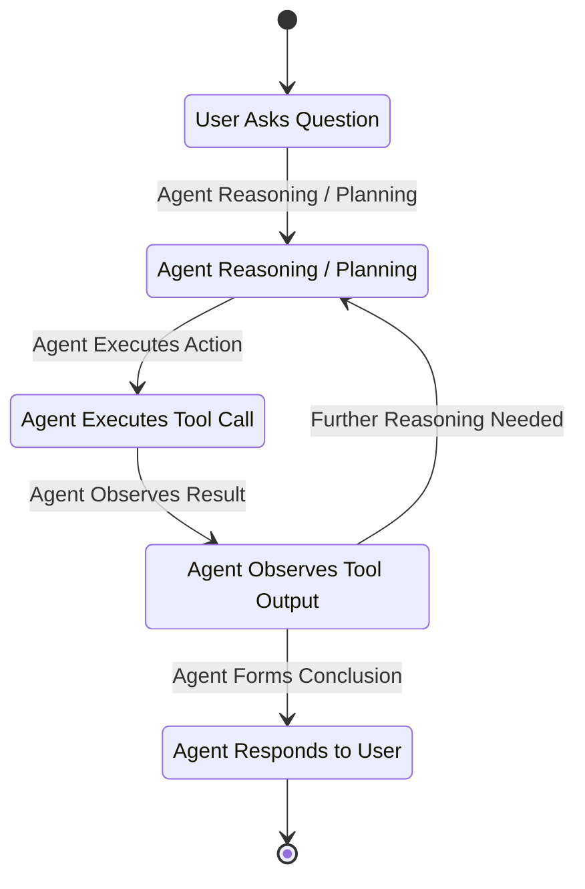

## Agent ReAct State Diagram
Install mermaid extension in vscode to view preview properly.

```mermaid
stateDiagram-v2
    [*] --> UserPrompted
    UserPrompted: User Asks Question
    UserPrompted --> AgentReasoning: Agent Reasoning / Planning
    AgentReasoning: Agent Reasoning / Planning
    AgentReasoning --> AgentAction: Agent Executes Action
    AgentAction: Agent Executes Tool Call
    AgentAction --> AgentObservation: Agent Observes Result
    AgentObservation: Agent Observes Tool Output
    AgentObservation --> AgentReasoning: Further Reasoning Needed
    AgentObservation --> AgentConclusion: Agent Forms Conclusion
    AgentConclusion: Agent Responds to User
    AgentConclusion --> [*]
```
